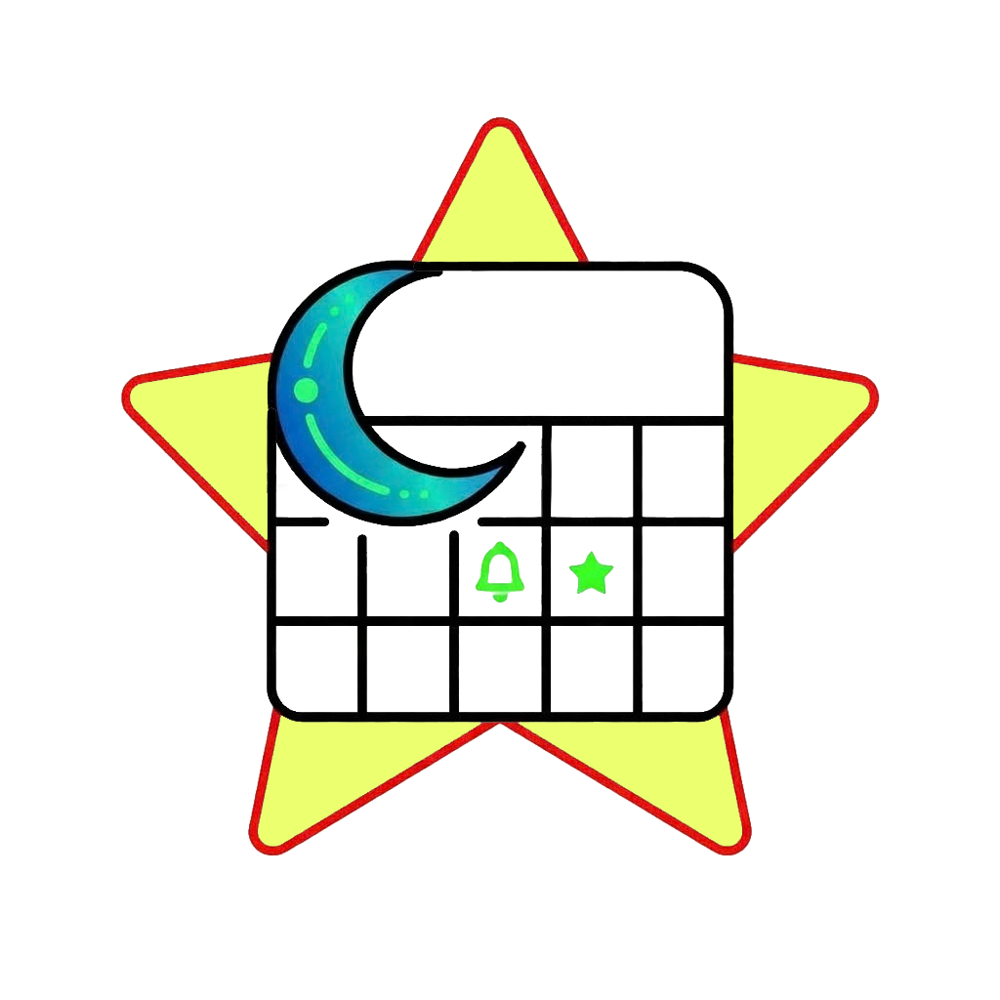

<div align="center">
  <h1>  VIE Lịch - App lịch Việt của người Việt</h1>

  <!-- Badges: Version & Stats -->
  [](https://github.com/toanbbpro/vie_lich/releases/latest)
  [](https://www.gnu.org/licenses/gpl-3.0)
  [](https://github.com/toanbbpro)
[](https://github.com/toanbbpro/vie_lich)
  [](https://github.com/toanbbpro/vie_lich/stargazers)
  <br>
  <!-- Badges: Built With -->
  [](https://flutter.dev)
  [](https://go.dev/)
  [](https://developer.apple.com/swift/)
  <br>
  <!-- Badges: Platforms -->
  [](#-cài-đặt)
  [](#-cài-đặt)
  [](#-cài-đặt)
  [](#-cài-đặt)
  <br><br>
  Ứng dụng xem lịch âm, dương và nhắc nhở ngày giỗ, họp họ, lễ hội truyền thống thuần Việt.

  <p>
    <a href="https://play.google.com/store/apps/details?id=com.toanbb.vie_lich"><b>Cài đặt trên Google Play</b></a> •
    <a href="https://toanbbpro.github.io/vie_lich/"><b>Trang giới thiệu (Landing Page)</b></a> •
    <a href="https://toanbbpro.github.io/vie_lich/privacy.html"><b>Chính sách quyền riêng tư</b></a>
  </p>
</div>

---

## 🌟 Tính năng

* **📅 Lịch ngày:** Hiển thị chi tiết ngày âm/dương, can chi, tiết khí, giờ hoàng đạo và sao tốt/xấu.
* **📆 Lịch tháng:** Giao diện lưới trực quan, xem bao quát cả âm lịch, dương lịch và các sự kiện nhắc lịch đã tạo.
* **🔔 Nhắc lịch & Sự kiện:** Tạo sự kiện theo lịch âm, đồng bộ sang lịch hệ thống và thông báo cục bộ. Hỗ trợ chia sẻ nhanh danh sách nhắc lịch qua mã QR.
* **⚙️ Tùy chỉnh thông báo:** Hỗ trợ chọn âm thanh thông báo hệ thống hoặc tải lên file âm thanh tùy chỉnh. Sao lưu/khôi phục dữ liệu app qua file JSON.
* **🔒 Riêng tư & Cục bộ:** Dữ liệu lưu hoàn toàn trên máy, không gửi máy chủ bên ngoài, không quảng cáo.
* **📆 Widget màn hình chính:** Widget lịch tháng 4x3 ngoài Homescreen (Android), hiển thị trực quan các mốc nhắc lịch tiếp theo.

---

## 📱 Giao diện ứng dụng

<details>
<summary><b>Bấm vào đây để xem ảnh chụp màn hình</b></summary>
<br>

<div align="center">
  
  
  
  
  
  
  
  
  
</div>

</details>

---

## 🛠 Công nghệ sử dụng

* **[Flutter](https://flutter.dev/):** Khung ứng dụng đa nền tảng chính (Android, iOS, Desktop).
* **[Go](https://go.dev/):** Xây dựng helper backend/service chạy nền trên Windows.
* **[Swift](https://developer.apple.com/swift/):** Xử lý native bridge cho nền tảng iOS.
* **[Hive CE](https://pub.dev/packages/hive_ce):** Cơ sở dữ liệu NoSQL cục bộ tốc độ cao.
* **Thuật toán Hồ Ngọc Đức:** Đảm bảo độ chính xác tuyệt đối cho việc tính toán Âm lịch theo múi giờ Việt Nam (UTC+7).

---

## 📥 Cài đặt

| Nền tảng | Hình thức cài đặt | Liên kết tải |
| :--- | :--- | :--- |
| **Android** | Google Play Store | [Tải từ Google Play](https://play.google.com/store/apps/details?id=com.toanbb.vie_lich) |
| **Android** | Cài đặt trực tiếp file APK | [Tải bản APK mới nhất](https://github.com/toanbbpro/vie_lich/releases/latest) |
| **Windows** | Portable ZIP (Chạy ngay không cần cài) | [Tải bản ZIP](https://github.com/toanbbpro/vie_lich/releases/latest) |
| **macOS** | Bộ cài đặt DMG | [Tải bản DMG](https://github.com/toanbbpro/vie_lich/releases/latest) |
| **iOS** | Sideload IPA (AltStore / TrollStore / Sideloadly) | [Tải bản IPA](https://github.com/toanbbpro/vie_lich/releases/latest) |

> **Lưu ý cập nhật:** Ứng dụng tích hợp sẵn cơ chế kiểm tra và cập nhật tự động từ GitHub Releases cho các bản cài đặt ngoài kho ứng dụng.

<details>
<summary><b>Dành cho nhà phát triển (Build từ mã nguồn)</b></summary>
<br>

```bash
# 1. Clone kho lưu trữ
git clone [https://github.com/toanbbpro/vie_lich.git](https://github.com/toanbbpro/vie_lich.git)

# 2. Di chuyển vào thư mục
cd vie_lich

# 3. Tải các thư viện phụ thuộc
flutter pub get

# 4. Build file tùy nền tảng
## Android apk
flutter build apk --release --dart-define=PLAY_STORE=false
## iOS nosign
flutter build ipa --release --export-method development
## MacOS
flutter build macos --release
## Windows - chỉ trên branch windows
flutter build windows --release
```
</details>
## 🚩 Kế hoạch phát triển - Roadmap

*   Publish app lên Google Play Store.
*   App cho Windows, chú trọng desktop widget và notification icon vì sẽ là giao diện thường xuyên nhìn vào nhất.
*   App cho macOS, chú trọng menubar và widget desktop nếu khả thi.
*   App cho Linux, cụ thể Zorin OS, chú trọng menubar và widget desktop nếu khả thi.
*   App cho iOS, nhưng không đưa lên App Store, chỉ hỗ trợ sideload.

## 📄 Giấy phép

* **Mã nguồn (Source Code):** Được phát hành dưới giấy phép **[GPL v3](LICENSE)**. Bạn có thể tự do xem, sửa đổi và phân phối lại mã nguồn theo điều khoản của giấy phép này.
* **Tài nguyên (Assets):** Tất cả các tài nguyên hình ảnh, logo (bao gồm `vie_lich_logo.png`), biểu tượng và âm thanh nằm trong thư mục `assets/` đều thuộc bản quyền của tác giả (Copyright © 2026 ToànBB). **KHÔNG** áp dụng giấy phép GPL v3 cho các tài nguyên này. Bạn không được phép sao chép, sử dụng lại hoặc phân phối các tài nguyên này cho mục đích thương mại hay gắn vào dự án khác khi chưa có sự cho phép.
---

## 📊 Lịch sử Star

<div align="center">
  <a href="https://star-history.com/#toanbbpro/vie_lich&Date">
    
  </a>
</div>

---